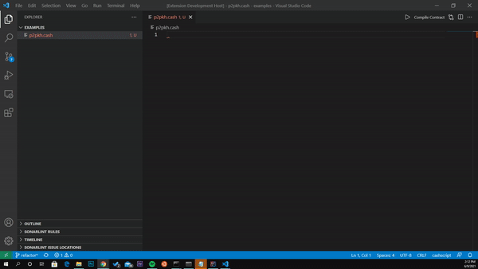

# vscode-cashscript

Vscode-cashscript provides tools that make it easier for developers to write smart contracts with [cashscript](https://cashscript.org/).

## Features

- Syntax Highlighting
- Auto-Completion
- Snippets
- Linting
- Contract Compilation

## Instructions

Press **F5** or click the "**Compile Contract**" button in the top right. A json file containing the contract artifiact will be created in the same directory with the same name.

## Extension Settings

None available yet.

## Known Issues

Calling out known issues can help limit users opening duplicate issues against your extension.

## Release Notes

Check the [changelog](/CHANGELOG.md) for past releases. Latest stable version:

### 1.0.0

Initial release of vscode-cashscript. Features:
- Syntax Highlighting
- Auto-Completion
- Snippets
- Linting
- Contract Compilation (press F5 or click "Compile Contract")
